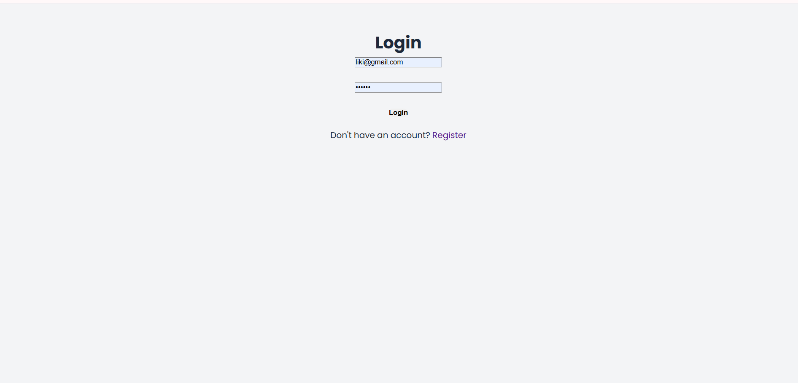
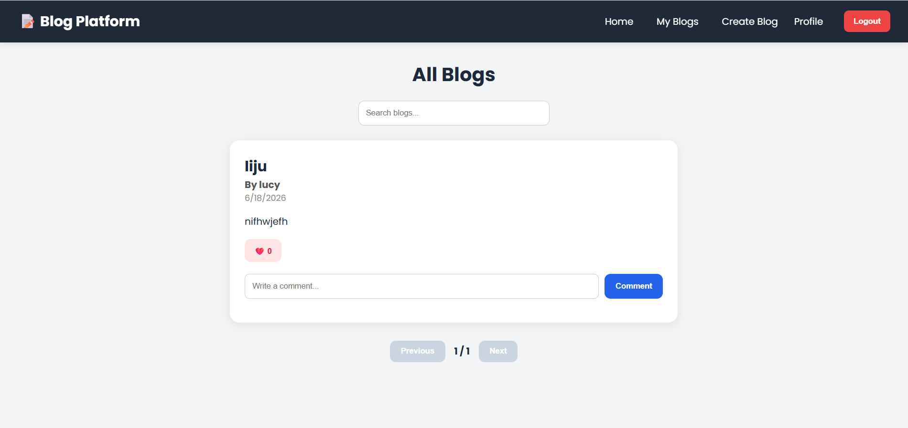
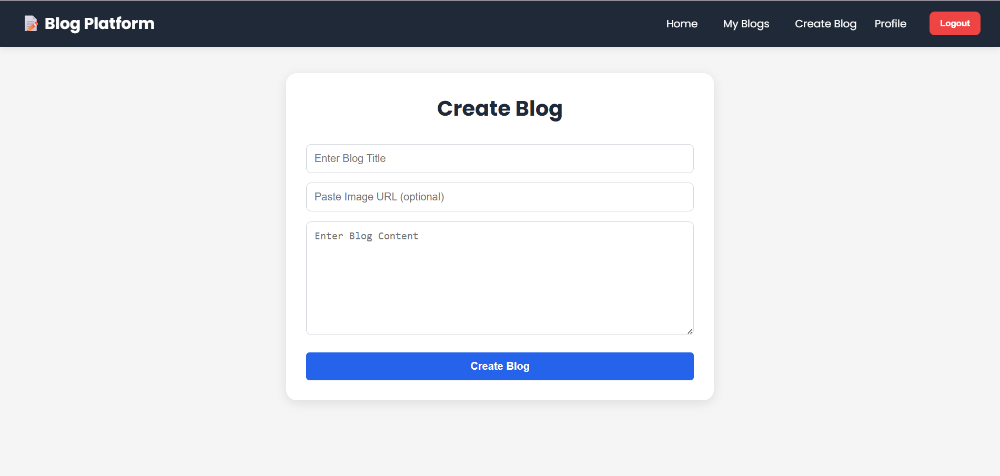
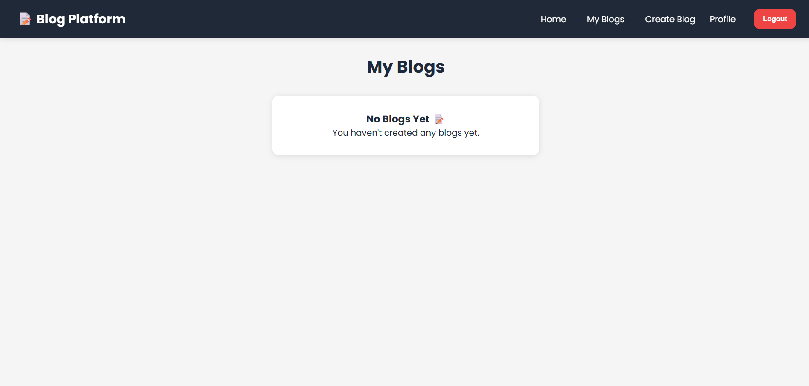
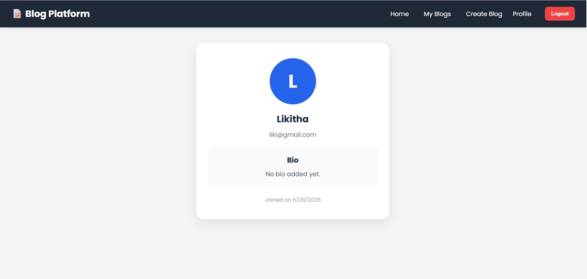

# 🚀 MERN Blog Platform

A full-stack blogging platform built using the **MERN (MongoDB, Express.js, React.js, Node.js)** stack that enables users to create, manage, and interact with blog posts through a modern and responsive interface.

The application implements secure authentication, social engagement features, and a scalable REST API architecture while providing a seamless user experience across devices.

---

## 🌐 Live Demo

**Frontend:** https://blog-platform-1xhs.vercel.app/

**Backend API:** https://blog-platform-api-xar7.onrender.com

> **Note:** The backend is hosted on Render's free tier and may take 30–60 seconds to wake up after inactivity.

---

## ✨ Key Features

### 🔐 Authentication & Security

* User Registration and Login
* JWT-based Authentication
* Password Encryption using bcrypt.js
* Protected Routes for Authenticated Users
* Persistent User Sessions

### ✍️ Blog Management

* Create New Blog Posts
* Edit Existing Blogs
* Delete Blogs
* View Detailed Blog Pages
* User Profile Management

### 💬 Social Features

* Like Blog Posts
* Comment on Blogs
* View Community Interactions

### 🔍 Search & Performance

* Search Blogs by Title
* Pagination for Better Performance
* Optimized API Calls using Axios

### 🎨 User Experience

* Responsive Design
* Modern and Clean Interface
* Mobile-Friendly Layout
* Fast Navigation with React Router

---

## 🛠️ Tech Stack

### Frontend

* React.js
* Vite
* React Router DOM
* Axios
* CSS3

### Backend

* Node.js
* Express.js
* MongoDB Atlas
* Mongoose
* JWT Authentication
* bcrypt.js

### Deployment

* Vercel (Frontend)
* Render (Backend)

---

## 📂 Project Structure

```text
blog-platform/
├── client/         # React Frontend
├── server/         # Express Backend
├── screenshots/    # Project Screenshots
└── README.md
```

---
## 📸 Project Screenshots

### Login Page


### Home Page


### Create Blog Page


### My Blogs Page


### Profile Page


## ⚙️ Installation & Setup

### Clone the Repository

```bash
git clone https://github.com/likitha-yarraguntla/blog-platform.git
cd blog-platform
```

### Install Dependencies

```bash
cd client
npm install

cd ../server
npm install
```

### Configure Environment Variables

Create a `.env` file inside the `server` directory.

```env
PORT=5000
MONGO_URI=your_mongodb_connection_string
JWT_SECRET=your_secret_key
```

### Run the Application

#### Backend

```bash
cd server
npm run dev
```

#### Frontend

```bash
cd client
npm run dev
```

---

## 🚀 Learning Outcomes

Through this project, I gained practical experience in:

* Building Full-Stack MERN Applications
* Designing RESTful APIs
* Implementing JWT Authentication
* Integrating MongoDB Atlas with Mongoose
* Managing Application State and Routing
* Building Responsive User Interfaces
* Deploying Applications using Vercel and Render

---

## 🔮 Future Enhancements

* Rich Text Editor for Blogs
* Blog Categories and Tags
* Bookmark and Save Feature
* User Follow System
* Email Verification
* Image Upload Support
* Admin Dashboard and Analytics
* Real-Time Notifications

---

## 👩‍💻 Developer

**Likitha Yarraguntla**

Aspiring Full Stack Developer with strong interest in Python, MERN Stack Development, and Data Structures & Algorithms.

* GitHub: https://github.com/likitha-yarraguntla
* LinkedIn: https://www.linkedin.com/in/likitha-yarraguntla-11a496395/
* LeetCode: https://leetcode.com/u/8309663069/

⭐ If you found this project useful, consider giving it a star on GitHub.
